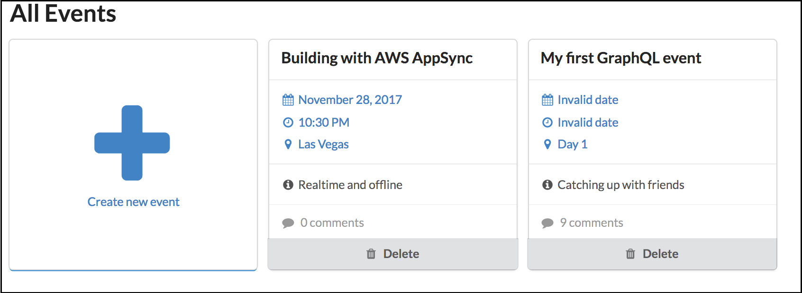
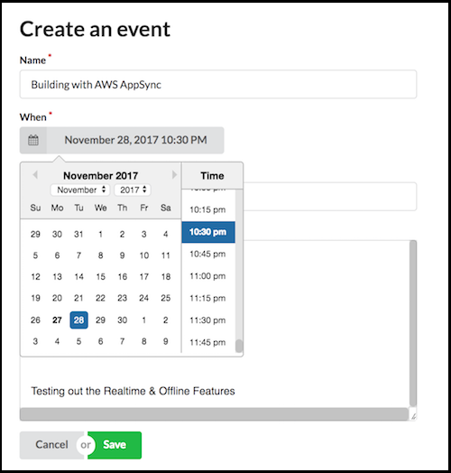

# Introduction

This is a Starter React application for using the Sample app in the AWS AppSync console when building your GraphQL API. The Sample app creates a GraphQL schema and provisions Amazon DynamoDB resources, then connects them appropriately with Resolvers. The application demonstrates GraphQL Mutations, Queries and Subscriptions using AWS AppSync. You can use this for learning purposes or adapt either the application or the GraphQL Schema to meet your needs.




## Features

- GraphQL Mutations
  - Create new events
  - Create comments on existing events

- GraphQL Queries
  - Get all events
  - Get an event by Id

- GraphQL Subscriptions
  - Real time updates for comments on an event

- Authorization
  - The app uses API Key as the authorization mechanism

## AWS Setup

1. Navigate to the AWS AppSync console using the URL: http://console.aws.amazon.com/appsync/home

2. Click on `Create API` and select the `Event App` under the `sample project` in the bottom pane, and select `Start`. Enter a API name of your choice. Click `Create`.


## React Setup

First, clone this repo:

```
git clone https://github.com/aws-samples/aws-mobile-appsync-events-starter-react.git
cd ./aws-mobile-appsync-events-starter-react
```

Wait until the progress bar at the top has completed deploying your resources. Then from the integration page of your GraphQL API (you can click the name you entered in the left hand navigation). 

On this same page, select `JavaScript` at the bottom to download your `aws-exports.js` configuration file by clicking the **Download Config** button. Replace the `aws-exports.js` file in the root of your app with the file you just downloaded.

Start the application:

```
yarn
yarn start
```

## Application Walkthrough

### ./src/App.js

- Sets up the application navigation between screens using `BrowserRouter` from React Router.
- Configures the `AWSAppSyncClient` using an API Key. This can be confugured to use Amazon Cognito Identity or Amazon Cognito User Pools as well.


### ./Components/AllEvents.js

- Uses Higher Order Components for making GraphQL calls to AWS AppSync.
- View to display all the events from `./GraphQL/QueryAllEvents.js`
- Allows you to delete individual events. This will use `./GraphQL/MutationDeleteEvent.js`

### ./Components/NewEvent.js

- Uses Higher Order Components for making GraphQL calls to AWS AppSync.
- View to create a new event using `./GraphQL/MutationCreateEvent.js`

### ./Components/ViewEvent.js and EventComment.js

- Uses Higher Order Components for making GraphQL calls to AWS AppSync.
- `ViewEvent` gets all the comments for a specific event when page loads with a GraphQL query defined in `./GraphQL/QueryGetEvent`
- Once the page loads, `EventComments` sets up a GraphQL subscription using `./GraphQL/SubscriptionEventComments` to display any new comments on an event in realtime.

### ./GraphQL Directory

- Contains GraphQL queries and mutations for interacting with AWS AppSync.

